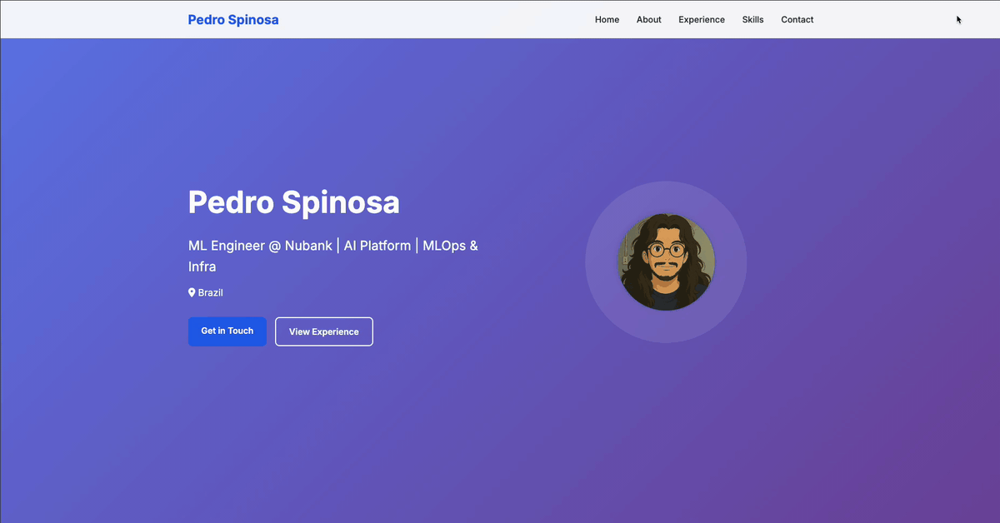

# Portfolio - A Forkable Portfolio Website

A modern, responsive portfolio website built with FastAPI and Jinja2. **Easily forkable** - just update the `portfolio.yml` file to customize your own portfolio!

## 📋 Table of Contents

- [📋 Quick Start](#-quick-start)
- [🚀 Quick Customization](#-quick-customization)
- [🏗️ Project Structure](#️-project-structure)
- [🚀 Running the Application](#-running-the-application)
- [🧪 Testing](#-testing)
- [🚀 Deployment](#-deployment)
- [🔧 Development](#-development)
- [🤝 Contributing](#-contributing)
- [📄 License](#-license)
- [📞 Contact](#-contact)
- [🙏 Acknowledgments](#-acknowledgments)

## 🚀 Quick Start

### 🍴 Fork & Setup

1. **Fork this repository** on GitHub
2. **Clone your fork**:
   ```bash
   git clone https://github.com/YOUR_USERNAME/portfolio.git
   cd portfolio
   ```

### 👀 See It In Action

You can see how the portfolio will look like here: **[https://pedrospinosa.dev/](https://pedrospinosa.dev/)**



*More details in the portfolio*

### Prerequisites

- Python 3.11 or higher
- uv package manager

### Installation

1. **Install dependencies**
   ```bash
   uv sync
   ```

2. **Run the development server**
   ```bash
   uv run dev
   ```

3. **Open your browser**
   Navigate to `http://localhost:8000`

## 🚀 Quick Customization

Edit `portfolio.yml` with your details. See [docs/CONFIGURATION.md](docs/CONFIGURATION.md) for complete setup instructions:

```yaml
personal:
  name: "Your Name"
  title: "Your Title"
  location: "Your Location"
  summary: "Your professional summary..."
  email: "your.email@example.com"
  linkedin: "linkedin.com/in/yourprofile"
  github: "github.com/yourusername"
  profile: "avatars.githubusercontent.com/u/yourid"
```

## 🏗️ Project Structure

```
portfolio/
├── src/
│   ├── __init__.py
│   ├── main.py            # FastAPI application
│   └── data.py            # YAML data loading and validation
├── templates/
│   └── index.html         # Main HTML template
├── static/
│   ├── css/
│   │   └── style.css      # Styles
│   ├── js/
│   │   └── main.js        # JavaScript functionality
│   └── images/            # Static images
├── portfolio.yml          # Your portfolio data (edit this!)
├── pyproject.toml         # Project configuration
└── README.md              # This file
```

## 🚀 Running the Application

```bash
uv run dev  # Development with auto-reload
uv run start  # Production mode
```

## 🧪 Testing

```bash
# Run all tests
uv run test

# Run tests with verbose output
python -m pytest tests/ -v

# Run specific test file
python -m pytest tests/test_data.py -v

# Run tests with coverage
python -m pytest tests/ --cov=src --cov-report=html
```

## 🚀 Deployment

The project uses GitHub Actions for automated quality checks and deployment:

### Workflow Structure

- **PR Checks** (`.github/workflows/pr.yml`): Runs on every PR and push to main
  - Code quality checks (ruff, mypy, pre-commit)
  - Security checks (bandit)
  - Unit tests
  - API endpoint testing

- **Deploy** (`.github/workflows/deploy.yml`): Runs after PR checks pass
  - Deploys to GitHub Pages
  - Only triggers on successful PR workflow completion

### Quality Gates

All code must pass:
- ✅ **Linting**: ruff code style checks
- ✅ **Type Checking**: mypy strict type validation
- ✅ **Tests**: All unit tests passing
- ✅ **Security**: bandit security analysis
- ✅ **Pre-commit**: All hooks passing

### Deployment

Deployment is fully automated:
1. Code is pushed to main branch
2. PR workflow runs all quality checks
3. If all checks pass, deploy workflow triggers
4. Application is deployed to GitHub Pages

**Note**: See [docs/DEPLOYMENT.md](docs/DEPLOYMENT.md) for detailed setup instructions, including required GitHub secrets configuration.

📚 **See [docs/README.md](docs/README.md) for details on how to configure and deploy your portfolio.**

## 🔧 Development

### Code Quality Tools

This project uses modern code quality tools:

```bash
# Install development dependencies
uv sync --extra dev

# Run linting and formatting
uv run ruff check .
uv run ruff format .

# Run type checking
uv run mypy src/

# Run all pre-commit hooks
uv run pre-commit run --all-files

# Install pre-commit hooks (run once)
uv run pre-commit install
```

### Testing

```bash
# Run the application
uv run dev

# Test API endpoints
curl http://localhost:8000/api/portfolio

# Run unit tests
uv run test

# Or run tests directly
python -m pytest tests/ -v
```

### Code Quality

The project enforces high code quality standards:

- **Ruff**: Fast Python linter and formatter
- **Mypy**: Static type checking
- **Pre-commit**: Git hooks for automated checks
- **Test Coverage**: Comprehensive unit tests

## 🤝 Contributing

1. Fork the repository
2. Create a feature branch (`git checkout -b feature/amazing-feature`)
3. Commit your changes (`git commit -m 'Add amazing feature'`)
4. Push to the branch (`git push origin feature/amazing-feature`)
5. Open a Pull Request

## 📄 License

This project is open source and available under the [MIT License](LICENSE).
## 📞 Contact

- **Email**: spinosaphb@gmail.com
- **LinkedIn**: [Pedro Spinosa](https://www.linkedin.com/in/pedrospinosa)
- **GitHub**: [pedrospinosa](https://github.com/pedrospinosa)

## 🙏 Acknowledgments

- FastAPI for the excellent web framework
- uv for modern Python package management
- Font Awesome for beautiful icons
- Google Fonts for typography
